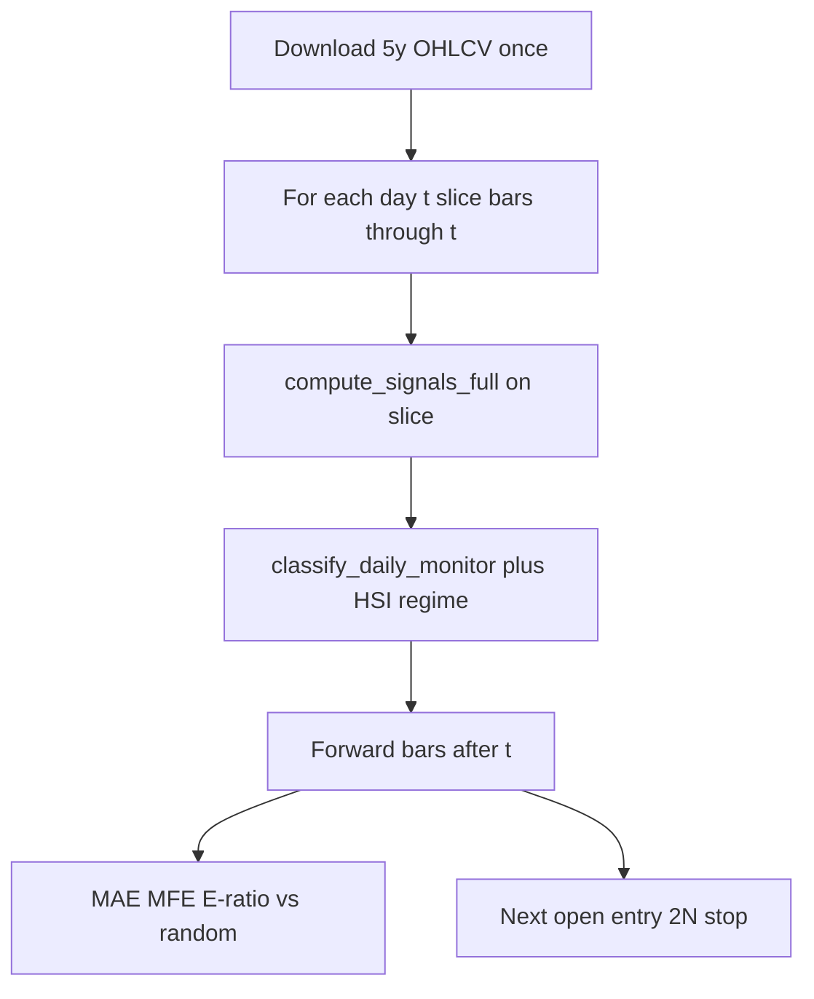

# HSI daily-monitor simulator plan

Reuse live rules. Do **not** extend [`src/core/backtest_engine.py`](../src/core/backtest_engine.py) (that scores LLM buy/sell text). Universe is [`HSI_STOCKS`](../src/services/hsi_scanner.py) plus `^HSI`. No GitHub workflow for replay (Yahoo-heavy, not CI).

Roadmap (delta, holdings, turtle book, HK universe, gates): [monitor-roadmap.md](monitor-roadmap.md). How to run: [hsi-monitor-sim.md](hsi-monitor-sim.md).



## Replay engine

[`src/services/monitor_simulator.py`](../src/services/monitor_simulator.py):

- Load histories via existing `fetch_history_batch_yfinance` + [`ohlcv_cache`](../src/services/ohlcv_cache.py). **Default `period=5y`**. `--period 2y` is a smoke run; `10y` is optional robustness, not the default.

## Local download

First run hits Yahoo once for HSI + `^HSI`, then writes pickle under `data/cache/ohlcv/` (`{CODE}_{period}_{YYYY-MM-DD}.pkl`). Replay only **slices** those frames in memory; it does not re-download per day.

The live cache is **same calendar day**. For the sim, also load the **newest pickle for that code+period** if today’s file is missing, so a 5y run overnight does not force another Yahoo pull. `--no-network` uses disk only and fails if nothing is cached. Gitignore covers `data/cache/` — **do not commit pickles**.

`--refresh` bypasses disk and re-downloads. No extra CSV/SQLite store.

- Align on the intersection of HSI trading dates (skip a name that day if that bar is missing).
- For day index `i` from warmup (`>=100` closes) to `len-1-horizon`:
  - Point-in-time: `evaluate_ticker_from_history(code, name, hist.iloc[:i+1])`. `compute_signals_full` already uses `iloc[-1]`, so this matches live.
  - Index: same slice on `^HSI`; pass `turtle_trend_ok` into `classify_daily_monitor` (weak index still omits uprising).
  - Caps: `HSI_SCAN_MONITOR_LIMIT` default 10; same `max_extension_n=1.0`.
- Dedup: if a code is still on the list from a first-cross on `previous` bar, count **one** alert on the first day it appears.

No RSI/MACD in admission. No LLM.

## Alert quality

For each alert, from **signal close** over the next `horizon` trading days (default 20):

- `mae_n` / `mfe_n`: adverse/favorable excursion vs signal close, divided by signal `n`
- `eratio = mean(mfe_n) / mean(mae_n)` per bucket (uprising / reversal); skip days with `n` missing
- Close-to-close at 1 / 5 / `horizon` days
- **Random control**: same day, same count, sample HSI names that were evaluable and **not** on either list (seeded RNG)

Report: n alerts, win rate (horizon close > signal close), median 5d/20d, E-ratio vs random. Label as **research, not a forecast**.

## Paper Turtle (simple)

Separate from E-ratio (entry is next bar, not signal close):

- Enter **next session open** (if missing, next close)
- Stop `entry - 2 * N` using N from the signal bar
- Exit first of: intraday low ≤ stop; time stop = `horizon` days; skip pyramids and unit limits
- Optional cost: `MONITOR_SIM_COST_BPS` default **20** round-trip, subtracted from paper return only
- One open trade per code; ignore a new alert while in a position
- Equal-weight 1 share of equity per trade: report avg R (`(exit-entry)/(2N)`), hit-stop rate, max DD of the daily mark-to-market of the open book (not a full 1% risk portfolio)

Uprising and reversal stay **separate books**.

## CLI and output

[`scripts/simulate_hsi_monitor.py`](../scripts/simulate_hsi_monitor.py):

```text
python scripts/simulate_hsi_monitor.py --period 5y --horizon 20 --limit 10
```

Download size stays small. **CPU** (classify every name every day) is the real cost.

**Survivorship:** `HSI_STOCKS` is today’s members replayed backward. Extra years add regimes but also names that were not in the index then. Do not treat a 10y E-ratio as a live-index backtest.

Writes `reports/hsi_monitor_sim_YYYYMMDD_HHMMSS.md` plus CSV of alerts/trades (not OHLCV). Offline re-runs: `--no-network`.

## Tests and docs

- [`tests/test_monitor_simulator.py`](../tests/test_monitor_simulator.py): synthetic frames. No Yahoo.
- [`docs/hsi-monitor-sim.md`](hsi-monitor-sim.md): how to run, 5y vs 2y/10y, survivorship, metrics.

## Out of scope (original simulator slice)

Full HK universe, ½N adds, 4-unit caps, S1 skip-winner portfolio logic, Web/API page, GitHub Action, changing live scan rules — those landed later in [monitor-roadmap.md](monitor-roadmap.md) P3/P4 and stay off live gates until P0.
