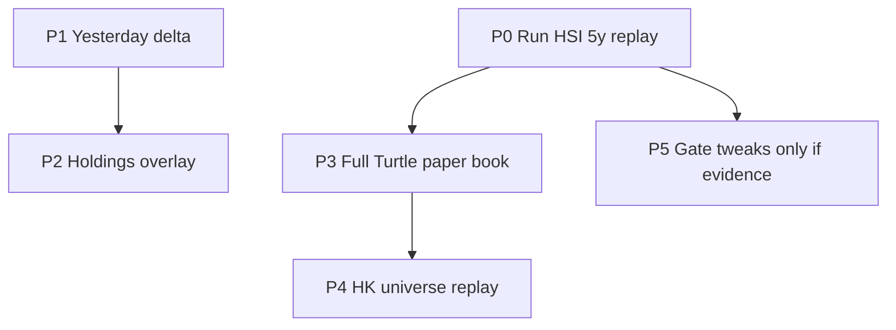

# Daily monitor + simulator roadmap

Sequenced slices for the Hang Seng / all-HK daily monitor. Live classifier stays frozen until a 5y HSI replay beats random.

**Failed** = both membership **Left** and a **follow-through failed** tag.

Do **not** put the 5y sim on GitHub Actions. Do **not** extend [`src/core/backtest_engine.py`](../src/core/backtest_engine.py). HK path stays no LLM.

How to run the replay on a fresh clone: [HSI 每日监控回放](hsi-monitor-sim.md). Engine design: [HSI daily-monitor simulator plan](hsi-monitor-simulator-plan.md).



## Status (as of 2026-09-16, branch `mine`)

| Slice | Status | Notes |
| --- | --- | --- |
| P0 2y then 5y HSI replay, record E-ratio vs random | **Not done** | Local runs were aborted. Other machine should start here. No live gate changes. |
| P1 Yesterday delta (新/仍在/离开/换桶 + 跟丢) | Done | Snapshot under `data/monitor_state/` (gitignored). Actions cache restore/save. |
| P2 Holdings overlay on monitor lists | Done | `持仓` + 距2N. HK uses `HSI_HOLDINGS` if set. No extra LLM. |
| P3 `--book turtle` | Done | 1% units, ½N adds, 4/name 12 total, Donchian exit. Simulator only. |
| P4 `--universe hk` | Done | Live liquidity gates. Use `--codes` to smoke. Not CI. |
| P5 Live gate tweaks | **Blocked on P0** | Only if 5y E-ratio vs random supports a change. Own PR with numbers. |

---

## P0 — Run the 5y HSI replay (no product code)

After cache is warm:

```text
python scripts/simulate_hsi_monitor.py --period 2y
python scripts/simulate_hsi_monitor.py --period 5y
```

Read [`docs/hsi-monitor-sim.md`](hsi-monitor-sim.md). Compare uprising vs reversal vs random E-ratio and 2N paper avg R after 20 bp.

If uprising E-ratio is not clearly above random, **do not** tighten live gates in the same breath as P1–P4. P5 is a later PR with the numbers in the description. Survivorship (today’s [`HSI_STOCKS`](../src/services/hsi_scanner.py) played backward) stays in the write-up.

`--progress-every` (default 20) logs every N replay days in [`src/services/monitor_simulator.py`](../src/services/monitor_simulator.py). No rule changes.

---

## P1 — Yesterday delta (HK + HSI)

Snapshot + classify in [`src/services/daily_monitor.py`](../src/services/daily_monitor.py); keep caps and admission rules unchanged.

**Snapshot** (gitignored under `/data/`): `data/monitor_state/{hsi|hk}_{YYYY-MM-DD}.json` with as-of date, `index_trend_ok`, and per shown name: `code`, `bucket`, `close`, `n`, `stop_long_2n`, S1/S2 close flags. Load the latest file with date **before** this run’s session date (skip today if a re-run). Missing snapshot → no delta, report says 无昨日对照.

**Membership (per bucket, on the capped lists):**

- **新**: today, not yesterday
- **仍在**: both days, same bucket
- **离开**: yesterday, not today
- **换桶**: yesterday other bucket, today this one (not 离开)

**Follow-through failed** (tag, not a fourth list): yesterday on **either** capped list, and today’s **evaluated** row (from `results`, even if capped off) has:

- low or close at/below yesterday `stop_long_2n`, or
- S2 event yesterday and today’s `close_vs_s2_entry` is false, or S1-only event and today’s `close_vs_entry` is false

A name can be **仍在** and **跟丢**. 离开 can also be 跟丢.

Render: extra column `对照` on `format_monitor_table_lines` (新/仍在/换桶) plus a short **离开 / 跟丢** subsection under each list. No 档/分.

**Actions:** restore/save `data/monitor_state` with `actions/cache` in [`.github/workflows/hsi_scan.yml`](../.github/workflows/hsi_scan.yml) and [`.github/workflows/hk_stocks_scan.yml`](../.github/workflows/hk_stocks_scan.yml). First Actions run after this ships will have no yesterday.

Tests in [`tests/test_daily_monitor.py`](../tests/test_daily_monitor.py). Docs: [`docs/hk-stocks-scan.md`](hk-stocks-scan.md), changelog, `.env.example` (`MONITOR_DELTA=true` default).

---

## P2 — Holdings overlay (no extra LLM)

HSI already prints holdings via `turtle_holding_action` / `HSI_HOLDINGS`. P2 is the **monitor lists**, not a second sell/keep engine.

- Tag uprising/reversal rows when `code` is a holding: column `持仓` + 距2N (`distance_to_stop_n`).
- Compact line per holding: 在趋势首破 / 在止跌转折 / 未入名单, plus existing sell/keep/buy.
- HK: if `HSI_HOLDINGS` is set, attach the same overlay in [`src/services/hk_stock_scanner.py`](../src/services/hk_stock_scanner.py). Empty env → no section.

---

## P3 — Full Turtle paper book (simulator only)

New helper: [`src/services/turtle_paper_book.py`](../src/services/turtle_paper_book.py), CLI `--book turtle`.

Reuse live alerts as **entry candidates** (uprising → S2 or allowed S1; reversal stays a **separate** book).

Turtle book v1 (Faith ch15, HK stocks not futures):

- Account notional env `MONITOR_SIM_EQUITY` default 1_000_000; unit = 1% equity / N shares, truncated
- Add ½N, max 4 units per name; stop 2N from last fill (move stop up with adds)
- S1 skip-if-last-winner already in `s1_entry_allowed`; do not enter S1 when that is false
- Exit: S1 10d low / S2 20d low **or** stop, first hit; no time-stop in this book (simple book keeps horizon time-stop)
- Caps: max 12 units total, max 4 per name; **no** sector map
- Same 20 bp round-trip on each fill

---

## P4 — HK replay

Same engine, `--universe hk` loading [`resources/universes/hk_all_stocks.json`](../resources/universes/hk_all_stocks.json) plus `^HSI`. Apply HK liquidity gates (`HK_SCAN_MIN_PRICE` / `HK_SCAN_MIN_AVG_TURNOVER`) **before** classify, matching live monitor. Default still HSI.

`--codes` subset for smoke. Full HK 5y is a long local job, not CI.

---

## P5 — Live gate tweaks (explicitly ungated until P0)

No preset for `max_extension_n` / volume / MA100. Only if P0 shows a gate that lifts E-ratio vs random without emptying the list. Own PR, numbers in the description.

---

## Out of scope (whole roadmap)

Web/API page, sim on Actions, point-in-time HSI membership, `potential_score` as a forecast, ½N adds on the **live** daily lists, changing HK to use LLM.
